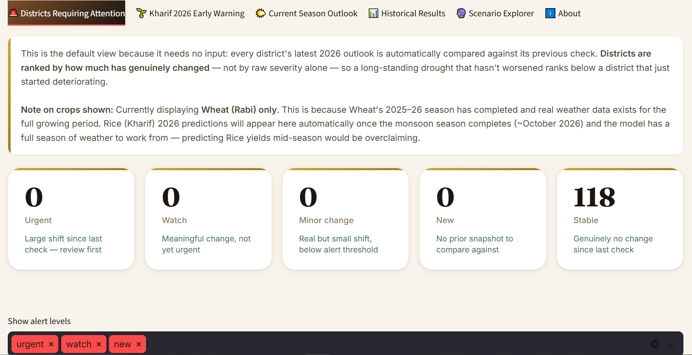
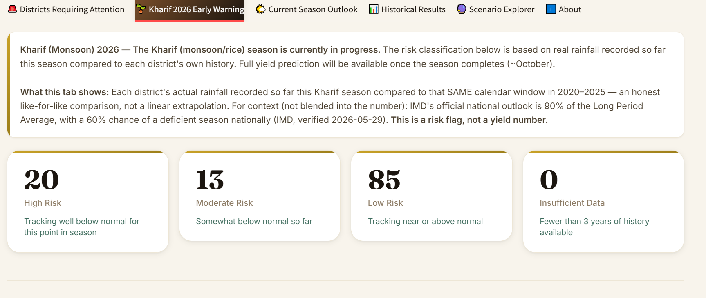

<div align="center">

# 🌾 ANNA
### Agricultural Nowcasting and Nearly-live Analytics

**District-level Wheat & Rice yield prediction and early-warning decision support for 118 districts across Haryana, Punjab, and Uttar Pradesh, India.**

[](https://www.python.org/)
[](https://xgboost.readthedocs.io/)
[](https://power.larc.nasa.gov/)
[](https://earthengine.google.com/)
[](https://fastapi.tiangolo.com/)
[](tests/test_pipeline.py)
[](LICENSE)

</div>

> **अन्न (Anna)** — Sanskrit for "food" or "grain." The Taittiriya Upanishad declares *Annam Brahma* — "food is divine." Named after the oldest Sanskrit word for the crop itself, ANNA predicts food availability at the district level, one season ahead.

> **A note on naming:** this product is branded **ANNA**; the underlying repository, Python package, and script filenames retain their original working name (`NAIP`, `naip_api.py`, etc.) from earlier in development. Nothing was renamed at the code level to avoid breaking a large number of tested references — see [`api/naip_api.py`](api/naip_api.py) and the folder structure below.

---

## Table of Contents

- [What This Is](#what-this-is)
- [Screenshots](#screenshots)
- [Project Goals](#project-goals)
- [Architecture](#architecture)
- [Key Results](#key-results)
- [Feature Set](#feature-set-40-features)
- [Engineering Audit Trail](#engineering-audit-trail)
- [Automated Validation](#automated-validation)
- [Project Structure](#project-structure)
- [Setup](#setup)
- [Deployment](#deployment)
- [Dashboard Tabs](#dashboard-tabs)
- [API Endpoints](#api-endpoints)
- [RAG / Live Grounding Layer](#rag--live-grounding-layer)
- [Honest Limitations](#honest-limitations)
- [Data Sources & Citations](#data-sources--citations)
- [License](#license)

---

## What This Is

ANNA is a **production-grade agricultural intelligence system** that predicts Wheat and Rice yields at the district level, one season ahead, and delivers those predictions through two interfaces that are actually built, running, and tested:

- A **live 6-tab Streamlit dashboard** with season-aware early warning, SHAP explanations in officer language, and a real-time District Watch alert feed
- A **REST API** (FastAPI, 6 endpoints, auto-generated Swagger docs) — reads the same pipeline outputs as the dashboard, no duplicated logic
- An **automated daily refresh pipeline** (8-step orchestrator, Windows Task Scheduler), plus a 9th optional step (`39_publish_to_azure_sql.py`) that's written but has no Azure Database to publish to yet
- A **validated sanity gate** with an auditable, self-expiring override mechanism, backed by a 30-test regression suite

**Not yet built, despite being designed and documented below:** a Power BI reporting layer, Docker containerization, and Azure Kubernetes Service deployment. Dockerfiles and Kubernetes manifests exist in `deploy/` as a written, YAML-validated starting point — but no image has been built, no cluster exists, and no Power BI report has ever been opened. See [Deployment](#deployment) for the exact, honest status of each piece.

It is not a research prototype. It is a running system with real live data and a documented audit trail of every real bug found and fixed during development — including bugs still being found and fixed in production.

**Live outputs (as of 2026-07-08 — this section moves with every refresh; re-verify before quoting elsewhere):**
- 118 districts monitored across 3 states
- Mean Wheat 2026 outlook: **4,323 kg/ha**
- Kharif 2026 risk: currently showing a severe, independently-verified early monsoon deficit across most districts — see the [Case Study](#case-study-the-kharif-2026-investigation) below
- Last refresh: daily, automated

---

## Screenshots

<table>
<tr>
<td width="50%">

**District Watch homepage**


</td>
<td width="50%">

**Kharif 2026 Early Warning tab**


</td>
</tr>
</table>

---

## Project Goals

This system was built to serve four goals simultaneously:

| Goal | Status |
|---|---|
| B.Tech major project | ✅ Complete — working end-to-end system, public GitHub |
| Research paper | ⏳ In progress — all methodology documented and validated |
| Patent filing | ⏳ Draft started — time-sensitive given public repo; provisional filing recommended |
| Portfolio / demo | ✅ Complete — live dashboard, live REST API, demoable in minutes |
| Cloud deployment (Docker/AKS/Power BI) | ❌ **Not built** — Dockerfiles and Kubernetes manifests exist as a design/starting point only; never built, deployed, or run against real infrastructure. See [Deployment](#deployment) for the honest status. |

---

## Architecture

```
DATA SOURCES                    PIPELINE (scripts 00–40)              OUTPUTS
────────────                    ────────────────────────              ───────
NASA POWER API (daily)  ──►  22 fetch current weather            Streamlit Dashboard (6 tabs) [BUILT]
                             26 fix fill values (-999 bug)        FastAPI REST API (6 endpoints) [BUILT]
MODIS NDVI (GEE)        ──►  34 fetch NDVI historical            Power BI (via Azure SQL) [DESIGNED, NOT BUILT]
                             35 fetch NDVI current (live)         District Watch alerts [BUILT]
JRC Surface Water (GEE) ──►  36 fetch surface water              Kharif 2026 risk flags [BUILT]
                                                                   Walk-forward CV (12 folds) [BUILT]
Govt Yield Records      ──►  15 aggregate weather                 SHAP importance rankings [BUILT]
(1997–2019, 118 dist.)       16 merge full weather                Per-decile interval calibration [BUILT]
                             17 feature engineering v2
Kuruva et al. 2025      ──►  37 load groundwater ─── ►  38 residual analysis (finding, not feature)
(Groundwater, Nature
Scientific Data)

Model: 19 tune xgboost → 20 finalize (SHAP + quantile intervals)

Automated:  00_run_full_refresh.py
            runs 22→26→25→35→27→28→32→33→39 daily
            (39 = optional Azure SQL publish for Power BI - written, never run against
            real Azure; no-op locally with no effect on the other 8 steps)
            logs to logs/refresh_YYYYMMDD_HHMMSS.log

Deployment: Docker → Azure Container Registry → Azure Kubernetes Service
            [DESIGNED, NOT BUILT - see Deployment section below for the honest status]
```

---

## Key Results

| Metric | Value | Notes |
|---|---|---|
| Model | Tuned XGBoost | 40 features, `learning_rate=0.05`, `max_depth=8`, `n_estimators=600` (verified against `outputs/metrics/xgb_best_params.json`) |
| Test R² (2018–19) | **0.8592** | Chronological split — train ≤2015, valid 2016–17, test 2018–19 |
| Test RMSE | **343.9 kg/ha** | |
| Test MAPE | **8.2%** | Wheat: 6.7%, Rice: 8.7% |
| Walk-forward R² | **0.19 – 0.93** | 12 folds (2008–2019), mean 0.77 ± 0.21 |
| Interval coverage | **82.1%** | Target: 70–90%; uses quantile_alpha=0.02/0.98 |

> **Walk-forward range is reported explicitly** (0.19–0.93, not just the headline 0.86). Weaker folds are documented in the dashboard's About tab and methodology section, not hidden behind the single-split number. Chronological validation directly contrasts with the random 80/20 splits common in published Indian crop yield papers, which can inflate reported accuracy via data leakage.

---

## Feature Set (40 features)

| Category | Features | Source | Completeness |
|---|---|---|---|
| Autoregressive | lag_yield_1/2/3, rolling_yield_3yr, time_trend, yield_trend, yield_gap_vs_state | Govt records | 90–100% |
| Live weather (seasonal) | rainfall, temp, humidity, solar (Kharif + Rabi + Annual) | NASA POWER | 100% |
| Agronomic (engineered) | GDD_kharif/rabi, max_dry_streak_kharif/rabi, rainfall_cv_kharif/rabi, water_balance_kharif/rabi | Computed from NASA POWER daily | 100% |
| Drought/flood derived | drought_flag, flood_flag, rainfall_anomaly_index, heat_stress_days, frost_risk_days | Derived | 100% |
| NDVI (satellite) | ndvi_kharif, ndvi_rabi | MODIS MOD13Q1 via GEE | 91.4% (pre-2000: NaN expected) |
| Surface water | water_pct_kharif, water_pct_rabi | JRC Global Surface Water via GEE | 100% (1997–2021) |
| Management | fertilizer_per_ha, nitrogen_per_ha, irrigation_pct, log_area | ICRISAT/Mendeley | 63–65% (documented) |
| Structural | state_encoded, crop_encoded, season_encoded | Derived | 100% |

**Why groundwater is NOT a model feature:** Kuruva et al. (2025, Nature Scientific Data) provides quality-controlled groundwater depth for 28/118 districts (17% coverage) — not a random sample, but the better-monitored districts. Adding it directly risks selection bias, so instead a residual-correlation analysis (`src/38_groundwater_analysis.py`) was run: Pearson r=0.223, p=0.294 — not independently significant beyond what the existing weather/NDVI features already capture. This is itself a documented finding: the multi-source feature design adequately proxies water availability without direct water-table data.

---

## Engineering Audit Trail

This project treats every real defect found — during development *and* after deployment — as documentation, not something to quietly patch and forget. **11 real bugs** found so far, all covered by the regression suite:

| # | Bug | Symptom | Root Cause | Fix |
|---|---|---|---|---|
| 1 | Rabi season-window misalignment | Weather SHAP share only 7.3% for a wheat-belt model | Jan–Mar assigned to the *wrong* crop-year (same calendar year rather than Nov(Y)–Mar(Y+1)) | Switched to crop-year-correct aggregation; SHAP share roughly doubled |
| 2 | Stale quantile models | Dashboard silently serving incorrect prediction intervals | `xgb_lower.pkl`/`xgb_upper.pkl` were pre-v2 leftovers, feature-schema-mismatched | Added the two missing `pickle.dump()` calls in script 20 |
| 3 | Kharif pacing bug | 117/118 districts "high risk" simultaneously | Linear pacing of partial rainfall across the full season, compared to a full-season average — structurally biased for any early-season window | Switched to same-calendar-window comparison |
| 4 | District Watch silent gap | 98% "stable" classification despite real variance (std=51.5) | A 5–150 kg/ha change range had no category — fell through silently to "stable" | Added `minor_change` category |
| 5 | Windows pipe encoding crash | Orchestrator stopped at step 2 with `cp1252` error | Python falls back to Windows codepage `cp1252` under a subprocess pipe; Unicode checkmarks (✓) crash it | Set `PYTHONIOENCODING=utf-8` for all subprocess calls |
| 6 | Kharif window frozen at "June" past month-end | Dashboard/API still labeled the window "June 1–23" once the season reached July | Window hardcoded `month == 6`, with the cutoff taken as a bare day-of-month | Rewrote as a continuous day-offset from June 1, spanning June→October regardless of calendar month |
| 7 | NASA POWER fetch frozen at a hardcoded date | Live weather data stopped advancing past June 23, no matter when the refresh ran | `end` date literally hardcoded as `"20260623"` in the API request, not computed from "today" | Compute `END_DATE` dynamically as `today - 3 days` (NASA POWER's typical processing lag) |
| 8 | `/districts` returning the wrong count | API returned 133 districts instead of the 118 actually modeled | Endpoint read the raw pre-filter district list, not the post-modeling set | Read from `current_predictions_2026.csv`'s actual district set instead |
| 9 | RAG panel silently vanishing | "Live Context" section simply didn't render, no error shown | `tavily-python` missing from `requirements.txt` — an indented, `try/except`-guarded import invisible to a naive top-level-only import scan | Added `tavily-python` to requirements; audited for other indented imports |
| 10 | Orchestrator's gate-detection broke by position | Adding a step after the sanity gate would have silently misreported gate failures as generic crashes | `is_last = (i == len(PIPELINE_STEPS))` identified the sanity gate by array position, not identity | Identify the gate step by name (`'pipeline_sanity_checks' in step`) instead |
| 11 | Single-district fetch failure masquerading as a real alert | A transient NASA POWER timeout for one district (Karnal, 2026-07-11) produced zero weather rows for that district only, which propagated three steps downstream into a spurious -730 kg/ha "urgent" District Watch alert — plus a *separate*, misleading sanity-gate false positive claiming the classifier itself was broken, when it had actually already correctly isolated the one real outlier | No retry on transient fetch errors; `weather_current_failures.csv` was logged but nothing ever read it; the diversity check compared dataset-wide variance instead of checking whether that variance was already correctly isolated outside the top category | Added retry-with-backoff to the NASA POWER fetch; added a new Check 5 that explicitly surfaces per-district fetch failures at the source; refined Check 2 to distinguish "real variance hidden inside the top category" (genuine bug) from "an outlier already correctly excluded from it" (working as designed) |

### Case Study: The Kharif 2026 Investigation

On 2026-07-08, a routine refresh triggered the sanity gate: 88% of districts had flagged "high risk" — structurally identical to Bug #3's signature. Rather than trust or dismiss it, three independent checks were run: `days_elapsed` variance across districts (only 1 day — ruled out a coverage-gap bug), the z-score distribution's shape (a real, non-degenerate spread — ruled out a classifier bug), and cross-verification against live news via the system's own RAG layer. All three confirmed this was a **genuine, severe, independently-reported 2026 monsoon delay** — not a defect — while surfacing a legitimate caveat: NASA POWER's processing lag meant the system couldn't yet see a rainfall recovery IMD's own July 7 briefing had already reported. The finding is now logged in `data/pipeline_overrides.json` — an auditable, evidence-required, **self-expiring** override, not a silenced check. When it expires, the gate goes back to failing until someone re-diagnoses it.

---

## Automated Validation

### Sanity Gate (`src/33_pipeline_sanity_checks.py`)
Runs after every pipeline refresh. 4 checks:
1. **Model/feature schema consistency** — all saved `.pkl` files must match `feature_list_v2.txt` exactly (caught bug #2)
2. **Classification diversity** — flags any risk/alert output where >85% of rows collapse to one category, with smart disambiguation of benign cases from real bugs (caught bug #3, #4, and correctly flagged the Kharif 2026 case study above for manual review)
3. **Live feature plausibility** — flags if >50% of districts are simultaneously >3σ from historical range
4. **Required file presence** — all pipeline outputs must exist and be non-empty

### Override Mechanism (`data/pipeline_overrides.json`)
A manually-diagnosed, evidence-backed finding can be acknowledged without permanently disabling the check that caught it. Every override requires a reason, evidence, and an expiry date (max 14 days) — after which the check automatically re-arms, so a genuinely new bug producing the same shape later can't hide behind a stale override.

### Regression Suite (`tests/test_pipeline.py`)
30 pytest tests across 6 test classes, covering all 10 bugs above by name:
```bash
pytest tests/test_pipeline.py -v   # All 30 should pass
```

---

## Project Structure

```
NAIP/
├── src/                              # 45 scripts, numbered 00–40 (includes a few
│                                      #   sub-numbered debug/utility scripts)
│   ├── 00_run_full_refresh.py        # Master orchestrator (daily)
│   ├── 14_fetch_weather_all_districts.py
│   ├── 15_aggregate_weather_all.py   # Season-window fix + GDD/dry-streak/water-balance
│   ├── 16_merge_full_weather_retrain.py
│   ├── 17_feature_engineering_v2.py
│   ├── 19_tune_xgboost.py
│   ├── 20_finalize_tuned_model.py    # SHAP + calibrated quantile intervals
│   ├── 22_fetch_current_weather.py   # NASA POWER live pull
│   ├── 25_current_conditions.py      # Live Rabi 2025-26 feature assembly
│   ├── 27_generate_current_predictions.py
│   ├── 28_district_watch.py          # Snapshot/diff alert engine
│   ├── 32_kharif_early_warning.py    # Same-window risk classification
│   ├── 33_pipeline_sanity_checks.py  # Automated validation gate
│   ├── 34_fetch_ndvi_historical.py   # MODIS NDVI backfill (GEE)
│   ├── 35_fetch_ndvi_current.py      # Live NDVI for current season
│   ├── 36_fetch_surface_water.py     # JRC surface water (GEE)
│   ├── 37_load_groundwater.py        # Kuruva et al. 2025 loader
│   ├── 38_groundwater_analysis.py    # Residual-correlation finding
│   ├── 39_publish_to_azure_sql.py    # Power BI data feed (no-op without Azure SQL env vars)
│   ├── 40_model_validation.py        # Walk-forward CV + residuals + calibration
│   └── setup_tavily.py               # One-time Tavily API key setup
├── dashboard/
│   └── app.py                        # Streamlit app (1,704 lines, 6 tabs)
├── api/
│   └── naip_api.py                   # FastAPI REST API (6 endpoints)
├── deploy/                            # Docker + Kubernetes deployment configs
│   ├── Dockerfile.dashboard
│   ├── Dockerfile.api
│   ├── Dockerfile.refresh
│   └── k8s/
│       ├── 00-namespace-storage.yaml
│       ├── 01-secrets-template.yaml
│       ├── 10-dashboard.yaml
│       ├── 11-api.yaml
│       ├── 12-ingress.yaml
│       └── 20-refresh-cronjob.yaml
├── tests/
│   └── test_pipeline.py              # 30 pytest regression tests
├── data/
│   ├── raw/                          # NASA POWER, groundwater exports
│   ├── processed/                    # Merged, engineered datasets
│   ├── snapshots/                    # District Watch time-series
│   ├── secrets/                      # API keys (gitignored, never committed)
│   └── pipeline_overrides.json       # Auditable sanity-gate override log
├── outputs/
│   ├── models/                       # xgb_tuned.pkl, xgb_lower.pkl, xgb_upper.pkl
│   ├── metrics/                      # SHAP rankings, walk-forward CV, residuals
│   └── plots/
├── notebooks/
│   └── build_figures.py              # Reproducible figure generation for paper/report
├── docs/
│   └── screenshots/                  # README screenshots
├── logs/                             # Refresh logs (timestamped)
├── run_refresh.bat                   # Windows Task Scheduler entry point
└── requirements.txt
```

---

## Setup

### Prerequisites
- Anaconda / conda
- Google Earth Engine account (free, [signup here](https://earthengine.google.com/)) — for NDVI + surface water
- Tavily API key (optional, free 1000/month, [signup here](https://app.tavily.com/home)) — for live government scheme / MSP context

### Installation

```bash
conda create -n naip python=3.10
conda activate naip
pip install -r requirements.txt

# One-time Earth Engine authentication (opens browser)
python src/34_fetch_ndvi_historical.py

# Optional: set up Tavily for live policy context
python src/setup_tavily.py
```

### Historical pipeline (one-time, ~2–3 hours total)

```bash
python src/14_fetch_weather_all_districts.py
python src/15_aggregate_weather_all.py
python src/16_merge_full_weather_retrain.py
python src/17_feature_engineering_v2.py
python src/34_fetch_ndvi_historical.py
python src/36_fetch_surface_water.py
python src/16_merge_full_weather_retrain.py     # re-run with satellite features
python src/17_feature_engineering_v2.py         # re-run
python src/19_tune_xgboost.py
python src/20_finalize_tuned_model.py
python src/40_model_validation.py
```

### Daily live refresh

```bash
# Manual
python src/00_run_full_refresh.py

# Automated (Windows Task Scheduler → run_refresh.bat)
# An AKS CronJob is designed as a future alternative (see Deployment section) but not built
# Runs: 22 → 26 → 25 → 35 → 27 → 28 → 32 → 33 → 39
```

### Launch dashboard / API / tests

```bash
streamlit run dashboard/app.py
uvicorn api.naip_api:app --reload --port 8000   # Swagger UI: http://localhost:8000/docs
pytest tests/test_pipeline.py -v                 # Expected: 30 passed
```

---

## Deployment

> ⚠️ **Status: designed, not built.** Everything below describes Dockerfiles and Kubernetes manifests that exist as text files in `deploy/`, written and YAML-syntax-validated — but **never actually run**. No Docker image has been built, no container has been started, no Azure resource (ACR, AKS, SQL Database) has been created, and no Power BI report has ever been opened or connected. Treat this as a design spec and starting point for doing the real work, not as a description of a working deployment. The one thing that's had any real execution is `src/39_publish_to_azure_sql.py`, and only enough to confirm it exits cleanly when no Azure credentials are set — it has never connected to a real database.

Containerized and intended for Azure Kubernetes Service. Three images, three roles — deliberately *not* uniformly scaled in the design, since not every component would benefit from Kubernetes the same way:

| Component | Replicas (as designed) | Why |
|---|---|---|
| Dashboard | 1 | No per-user scaling need — not inflated just to "use" Kubernetes features |
| API | 2 | Stateless GETs genuinely benefit from rolling updates + self-healing |
| Refresh pipeline | CronJob | The strongest real justification for Kubernetes here — a scheduled, retried, resource-limited batch job replacing Windows Task Scheduler entirely, running even if no machine is physically on |

```bash
# NONE OF THIS HAS BEEN RUN. This is the intended sequence once you have an
# Azure subscription, Docker Desktop, and kubectl set up - not a record of
# what's already working.

# Build & push
docker build -f deploy/Dockerfile.dashboard -t <ACR_NAME>.azurecr.io/naip-dashboard:latest .
docker build -f deploy/Dockerfile.api       -t <ACR_NAME>.azurecr.io/naip-api:latest .
docker build -f deploy/Dockerfile.refresh   -t <ACR_NAME>.azurecr.io/naip-refresh:latest .
docker push <ACR_NAME>.azurecr.io/naip-dashboard:latest
docker push <ACR_NAME>.azurecr.io/naip-api:latest
docker push <ACR_NAME>.azurecr.io/naip-refresh:latest

# Deploy (in order)
kubectl apply -f deploy/k8s/00-namespace-storage.yaml
kubectl create secret generic naip-secrets -n naip --from-literal=... # see 01-secrets-template.yaml
kubectl apply -f deploy/k8s/10-dashboard.yaml
kubectl apply -f deploy/k8s/11-api.yaml
kubectl apply -f deploy/k8s/12-ingress.yaml
kubectl apply -f deploy/k8s/20-refresh-cronjob.yaml
```

Shared state (predictions, alerts, logs) would flow through an Azure Files `ReadWriteMany` volume mounted into all three workloads, so a fresh CronJob run becomes visible to the already-running dashboard/API pods without a redeploy. **Power BI** would connect directly to Azure SQL Database (populated by `src/39_publish_to_azure_sql.py` at the end of each refresh) on its own scheduled refresh — a separate, executive-facing data path, decoupled from the operational dashboard/API. None of this exists yet.

---

## Dashboard Tabs

| Tab | What it shows |
|---|---|
| 🚨 Districts Requiring Attention | District Watch homepage — zero-click, ranked alert feed, drill-down per district |
| 🌱 Kharif 2026 Early Warning | Risk classification by monsoon-so-far rainfall, season-aware, IMD context displayed separately |
| 🌤️ Current Season Outlook | Live Wheat 2026 predictions with calibrated 80% interval, live NDVI and surface water features |
| 📊 Historical Results | Validated 2018–19 predictions vs. actual yields — proof the model works |
| 🔮 Scenario Explorer | Real 2026 baseline what-if (rainfall/temperature sliders from live starting point) |
| ℹ️ About | System description, tab guide, honest limitations, data citations |

---

## API Endpoints

Every endpoint below was verified with real requests against real pipeline output — including a 404 for an unknown district, correct filtering with combined query params, and Swagger UI serving at `/docs`.

| Endpoint | Description |
|---|---|
| `GET /health` | System status, 40-feature schema check, data freshness per output file |
| `GET /predict/{district}` | Full prediction: yield, change vs. 2019, top 5 SHAP factors, drought/flood flags |
| `GET /predictions` | All 118 districts, filterable by `state` / `drought_only` / `sort_by` / `descending` |
| `GET /watch` | District Watch alert feed, filterable by `alert_level` |
| `GET /kharif-risk` | Kharif 2026 early-warning risk classification, filterable by `risk_level` |
| `GET /districts` | All 118 modeled districts (state, district) |

---

## RAG / Live Grounding Layer

When a district shows an alert, the system queries the live web (Tavily) in priority order: government relief schemes → MSP (Minimum Support Price) → IMD weather outlook. This layer is **enhancement-only** — its absence never breaks predictions, and a missing API key shows a plain-language card, not a raw error.

**Validated real finding:** this layer surfaced IMD's official 2026 Southwest Monsoon outlook (90% of LPA, 60% chance deficient, revised 29 May 2026) and, later, the July 7 PMO briefing showing the deficit narrowing to -12% — independently corroborating the Kharif 2026 case study above.

---

## Honest Limitations

- **Yield trend data lags by ~5 years.** Government district-level statistics are published 1–2 years late; the most recent published yield data is 2019, used as the trend signal even for 2026 predictions. A universal constraint of Indian agricultural statistics, stated explicitly.
- **Walk-forward accuracy varies significantly by year** (R² 0.19 in the weakest fold vs. 0.93 in the strongest). Both numbers are reported, not just the favorable headline.
- **Prediction interval calibration degrades in the highest yield quintile** (63% coverage vs. 82% average). Cross-check high-yield predictions with field data before acting on them.
- **Rice (Kharif) yield is not predicted mid-season.** The Kharif tab is a risk classification, not a yield forecast.
- **NASA POWER has a processing lag** (typically ~3 days) — near-real-time features do not reflect the most recent few days, which matters during a fast-changing weather event (see the Kharif 2026 case study).
- **Surface water uses 2021 as current baseline.** JRC Global Surface Water covers only to 2021; later years are approximated.
- **Groundwater covers 28/118 districts only** (Kuruva et al. 2025). Excluded from model features to avoid selection bias; used for a residual-correlation finding instead.

---

## Data Sources & Citations

| Source | What it provides | Citation / URL |
|---|---|---|
| NASA POWER | Daily weather 1997–present | [power.larc.nasa.gov](https://power.larc.nasa.gov/) |
| MODIS MOD13Q1 | NDVI 2000–present | NASA/USGS via Google Earth Engine |
| JRC Global Surface Water | Surface water extent 1984–2021 | Pekel et al. (2016), *Nature* 491, 418–422. Via GEE. |
| India Agriculture Crop Production | Yield, area, production 1997–2019 | Government of India, Ministry of Agriculture |
| ICRISAT/Mendeley | Fertilizer, irrigation, evapotranspiration | ICRISAT Village Dynamics in South Asia |
| Groundwater levels | Depth-to-water-table, 2000–2022 | Kuruva, S.K. et al. (2025). *Scientific Data* 12, 1609. DOI: [10.1038/s41597-025-05899-5](https://doi.org/10.1038/s41597-025-05899-5) |
| Tavily | Live government/IMD retrieval | [app.tavily.com](https://app.tavily.com) |
| Nominatim/OSM | District geocoding | OpenStreetMap contributors |

---

## License

MIT License. See [LICENSE](LICENSE) for details.

---

<div align="center">

*Built as a B.Tech major project by Kunal. Full engineering audit trail documented above and inline in each script's docstring.*

</div>