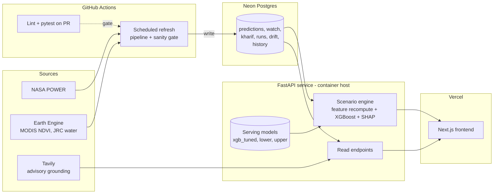

# NAIP System Architecture

**Status date:** 2026-10-04
**Scope:** target architecture for NAIP (ANNA) v2, plus an honest record of what exists today.

Legend: ✅ Built and run · 🔧 Built, needs refactor · 📐 Designed, not built

---

## 1. Purpose and constraints

NAIP is a **research system**: district-level wheat and rice yield prediction and early warning for 118 districts across Uttar Pradesh, Punjab and Haryana. Its design priorities, in order:

1. **Reproducibility.** Every number shown can be traced to a pipeline run, a model version and a data snapshot.
2. **Honesty about uncertainty.** Prediction intervals, drift status and data freshness are first-class outputs, not footnotes.
3. **Zero or near-zero cost.** Free tiers only, with no always-on paid infrastructure.
4. **Demonstrability.** A public web app and a documented API for the paper, patent and portfolio.

Non-goals: user accounts, alert subscriptions, multi-tenant use, real-time (sub-daily) serving.

---

## 2. Current state (as found in the repo)

| Component | Status | Notes |
|---|---|---|
| Pipeline: `src/00`–`src/42` | 🔧 | ~45 flat numbered scripts, some one-off or superseded. Orchestrated by `src/00_run_full_refresh.py` (8 live steps, stops on failure, ends with a sanity gate). |
| Scheduler | 🔧 | Windows Task Scheduler → `run_refresh.bat` with hardcoded local paths and conda. |
| Storage | 🔧 | Flat CSV/JSON/PKL in `data/`, `outputs/`. ~302 MB, gitignored. |
| API | ✅ / 🔧 | FastAPI, 6 GET endpoints, reads CSVs with an mtime cache. CORS is `*`, GET only. |
| Dashboard | 🔧 | One 1,754-line Streamlit file; reads CSVs and pickles directly, does not call the API. |
| Tests | ✅ | `tests/test_pipeline.py` (pytest). |
| Docker / Kubernetes / Azure | 📐 | Described in the README as designed, never built or run. Not in the uploaded zip. |

Known structural problems this architecture fixes: the UI and API read data through different paths, the pipeline is tied to one machine, serving data lives outside version control, and there is no scenario endpoint.

---

## 3. Target architecture

### Components

**Pipeline (`pipeline/`)** — Python package replacing the numbered scripts. Stages: ingest → features → predict → alerts → validate. The existing ordering and the fail-stop behaviour are preserved. The sanity gate stays the last line of defence, and a failed gate marks the run as *flagged* in the database so the UI can show it.

**Database (Neon Postgres)** — the single source of truth for everything the UI and API serve. See `database.md`.

**API (FastAPI, containerised)** — two roles:
- *Read API:* districts, predictions, watch, Kharif risk, history, pipeline health.
- *Scenario engine:* loads the serving models, recomputes derived features coherently, returns predictions, intervals and SHAP deltas. It needs xgboost, shap and pandas, which is why it cannot run in a Vercel serverless function.

See `api.md`.

**Frontend (Next.js on Vercel)** — talks only to the API, never to the database or files. See `ui-ux.md`.

**CI/CD (GitHub Actions)** — tests on every PR, a scheduled refresh, and deploys. See `ci-cd.md`.

---

## 4. Data flow

1. **Refresh (scheduled).** Actions runs the pipeline: fetch current weather (NASA POWER) → fix fill values → build current-season features → fetch NDVI (Earth Engine) → predict (+SHAP) → district watch diff → Kharif early warning → sanity gate.
2. **Persist.** Results are written to Postgres in one transaction per run, tagged with `run_id`, model version and gate result. A flagged run is stored but not promoted as "latest".
3. **Serve.** The API reads the latest *promoted* run. `/health` reports data freshness and the gate status.
4. **Scenario (on demand).** The browser sends a scenario → API loads the district baseline row → applies the change and recomputes dependent features → scores with the model → returns prediction, interval and SHAP delta.

**Promotion rule:** a run becomes "latest" only if the sanity gate passes. This keeps a bad refresh from reaching the UI, which is the main failure mode your 12 documented incidents point to.

---

## 5. Deployment topology

| Piece | Host (proposed) | Why |
|---|---|---|
| Frontend | Vercel | Native Next.js, free tier |
| API | Container host with a free tier (Render, Fly.io or Hugging Face Spaces) | Needs xgboost + shap; fits a ~250 MB limit poorly on serverless |
| Database | Neon Postgres (or Supabase) | Free tier, standard Postgres |
| Scheduler | GitHub Actions cron | Replaces Windows Task Scheduler; no local machine needed |

> Verify current free-tier limits, sleep behaviour and cold-start times for the chosen API host before committing. Free container hosts typically sleep when idle, so the frontend needs a loading state for the first request.

Environments: `local` (docker compose: Postgres + API + web), `preview` (Vercel PR previews against the production API in read-only use), `production`.

---

## 6. Security

- **Secrets** (Tavily key, Earth Engine service account, DB URL) live in GitHub Secrets and host environment variables, never in files. `data/secrets/` is removed from the project. Rotate the Tavily key if it was ever committed (`git log --all -- data/secrets`).
- **CORS** is restricted to the Vercel domain(s) instead of `*`.
- **Scenario endpoint** accepts only validated, bounded inputs (Pydantic) and is rate limited, since it runs model inference.
- **Pipeline write access** uses a separate DB role from the API (the API role is read-only).

---

## 7. Reliability and observability

- `/health` reports schema check, last run id and time, gate result and per-dataset freshness. This extends today's `/health`.
- Structured JSON logs from the pipeline and API; run logs are stored per run, replacing the committed `logs/` folder.
- The UI shows data freshness and any NASA POWER lag on every page, not only in advisory text.

---

## 8. Architectural decisions

| # | Decision | Alternatives rejected | Reason |
|---|---|---|---|
| D1 | Next.js frontend + separate FastAPI | Keep Streamlit; run everything on Vercel | Vercel can't host the ML stack; split gives a real client/server boundary |
| D2 | Postgres as serving store | Keep CSVs | One read path, queryable history, atomic run promotion |
| D3 | Scenario engine lives in the API | Client-side approximation | Must reuse the training feature code and the real model to stay consistent |
| D4 | GitHub Actions for refresh | Task Scheduler; k8s CronJob | No local machine dependency; no cluster needed |
| D5 | Ship only the serving models (~10 MB) | Rebuild models in CI | Small enough to version; avoids non-reproducible retraining |
| D6 | Promote runs only on gate pass | Always serve latest | Prevents bad data reaching users |

---

## 9. Open questions

1. **Where does historical reference data live for CI?** resolved. Reference data and serving models are committed to git, and run output goes in Postgres.
2. **Earth Engine headless auth.** Scheduled NDVI fetch needs a service-account credential. Not yet tested for this project; until it is, NDVI refresh stays a manual step.
3. **Which models serve?** `xgb_tuned` is used by prediction generation, `xgb_lower`/`xgb_upper` by the dashboard. `xgb_wheat`/`xgb_rice` (script 21) are not referenced by the live path; The scenario engine uses xgb_tuned for both crops, and xgb_wheat/xgb_rice stay unused in v2.
4. **Yield-lag baseline.** 2026 predictions use 2019 yield lags (`prediction_basis`). The UI and API must expose this on every prediction.
5. **District boundaries.** Only lat/lon exist today; polygons need a public source and a name-matching pass.
6. **Azure/Kubernetes.** "Azure/Kubernetes: dropped from v2." Also change "Dockerfiles and Kubernetes manifests exist as a design" to say they're out of scope.

---

## 10. Related documents

`database.md` · `api.md` · `systemdesign.md` · `ci-cd.md` · `ui-ux.md`